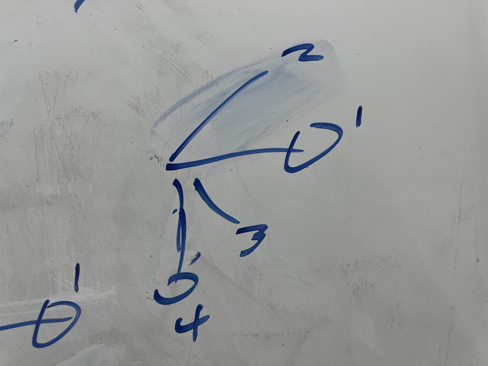
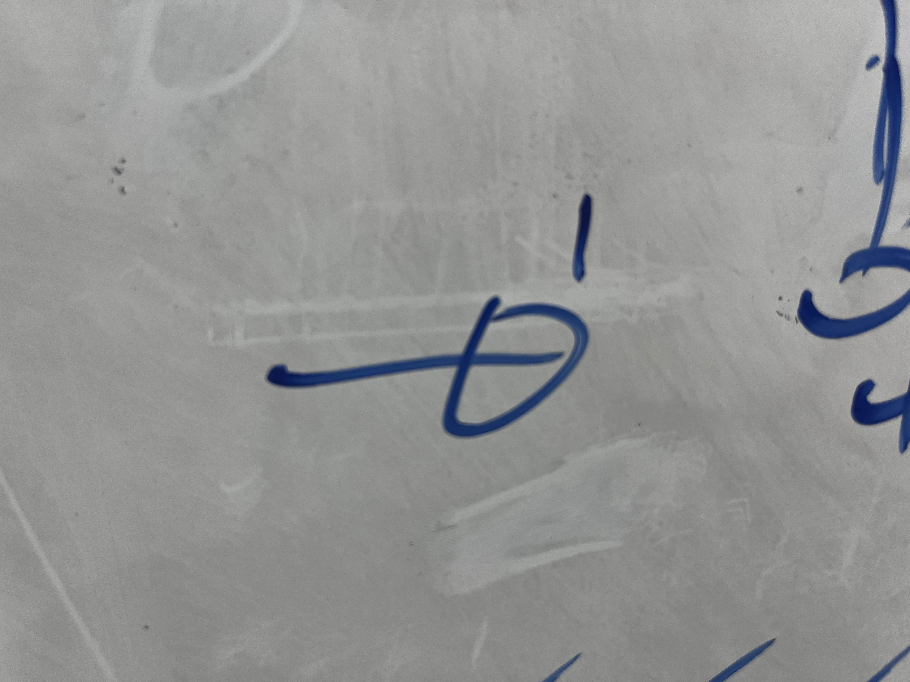
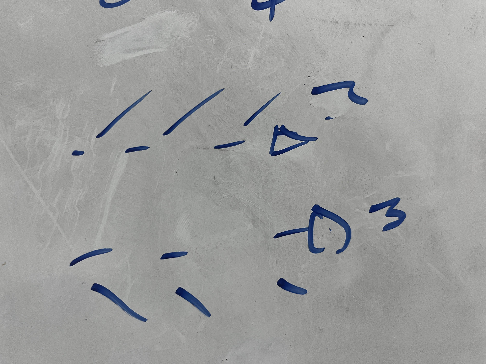
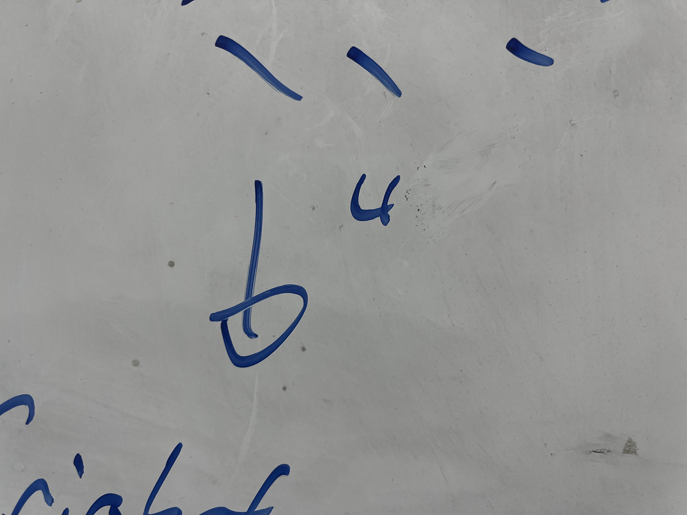
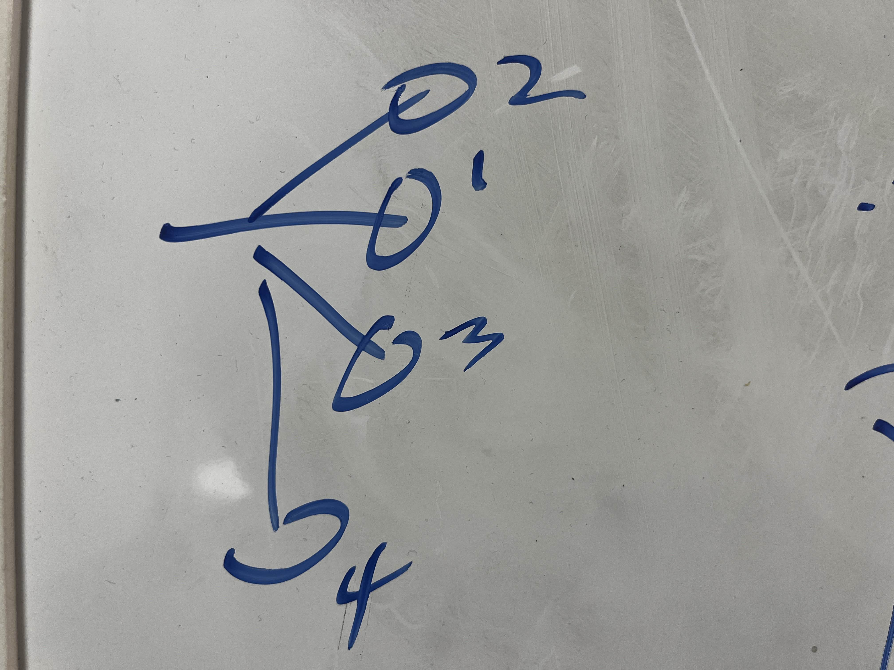

# Tic Tac Toe - DearIAmGUI

### Directory:

- [Part 1: The whole attempt](#the-tic-tac-toe-attempt---9182025)
- [Part 2: The review](#negamax-alpha-beta-pruning-and-a-review---9242025)

## The tic tac toe attempt - 9/18/2025

### As a starter, context

When initially tackling this assignment, I wanted to give myself a bit of a challenge, primarily due to the fact that I still find myself to be a bit rusty when it comes to cpp.

In turn, I let the demons win and I spit out this code base.

Am I giving the demons too much credit for this spaghetii, possibly.

But first, other thoughts before tackling the spaghetti.

### Planning for the after

I was already in the talks with Michael about doing a collab for content, outside of a quick short [which can be seen here if you'd like to regret life choices.](https://youtube.com/shorts/H9gZYjlgKks?si=tTV7F2bPx80lRPqt)

Long story short, we ended up on settling to make a version of Tic-Tac-Whoa, a spin-off of Tic-Tac-Toe in which pieces push other pieces away. 

### Tackling the current

When it comes to other elements outside of the main element, I found everything pretty easy to tackle after a nudge or two here and there. 

For instance, in the latter part of develeopment, I was reminded that even the way I was getting the owner of a piece was incorrect, since I was swapping the x and y coordinates.

On the other hand, there were somethings that I did that were memory inefficient, however, it then meant that I could expand the ptoject further. To take an example, I changed the initialStateString call to be built based on grid size, rather than to initialize a string at once. 

Memory inneficient, especially in some places like stateString?

Very.

But this allows to easy swap between board sizes and the instantiation of them, just by modifying the number of rows and collumns.

### The questionable algorithm in question

#### The main idea

Go through the grid; top-to-bottom, left-to-right.

That way every possible pattern is checked, regardless of board size.

Below, is a basic idea of this workflow 

##### Also, one more thing before moving forward

The code checks wins and losses with some vartion of this:

<pre>
<code>if (</code>
<code>  (state[y * _gameOptions.rowX + x] == state[y * _gameOptions.rowX + x + 1]) &&</code>
<code>  (state[y * _gameOptions.rowX + x] == state[y * _gameOptions.rowX + x + 2]) &&</code>
<code>  (state[y * _gameOptions.rowX + x] != '0')</code>
<code>){...}</code>
</pre>

So yeah... If my ifs look like a paragraph, that's why.

#### 1. Check the horizontals

Before checking anything horizontal, there must be at least 2 elements to the right that could fit alongside the space that is getting currently checked.

It leads to a larger bloack of code, but it's a safety nonetheless

The code in question

<pre>
<code>if (x + 3 <= _gameOptions.rowX) {...} </code>
</pre>

##### 1.1) Pure Horizontal

This portion is always checked first, given the fact that it is assumed that there is enough space to the right, then we can automatically check this as a possible win condition for either player.

##### 1.2 + 1.3) The Spine (upward and diagonal horizontal)

On the other hand, the code here is a bit wierder since it needs to check the space below and above. This then, has a safety check like this before moving forward.

<pre>
<code>if (y - 2 >= 0) {...} </code>
<code>---OR--- </code>
<code>if (y + 2 < _gameOptions.rowY) {...} </code>
</pre>

#### 2 Pillars

This portion is pretty straight forward, since all it will do is check if there's' below it, then if those elements match.

#### 2.1 The Pillar

Code for the quick space check.

<pre>
<code>if (y + 2 < _gameOptions.rowY) {...} </code>
</pre>

#### And as a recap

Since the code is going from top to bottom, then left to right, it'll start at the left most index, tackle each win possibility, then go on from there.

So as an example, this is what the next order for the following x would look like (imagine the line before the point in which everything else intersects is dotted)

### As for the extra credit...

Honestly, this portion was the best part, as it was fairly free form! 

When it came to the development of the AI, I just grabbed the code from todays lecture so that wasn't too much trouble.

However, I quite enjoyed having the opportunity to tear open the imgui docs to find what I'd need to add some UI to allow for devs to add their own gui elements, and then connect them button wise.

All in all, looking forward to more rat moments like this!

### In summary

I will continue to listen to the voices that tell me to make algorithms more complicated than they need to be.

In hindsight, would bit shifting have worked as an option? 

***Yes.*** 

However, five hundred ifs in two for loops go **brrrrrr**.

---

## Negamax, Alpha-Beta Pruning, and a Review - 9/24/2025

### But first, an algorithm update

So it was made apparent that I *may have had some more bugs in my code*...

With that in mind, did some digging, and all I could really find that was bugged was that I flipped the division and modulo in two separate places.

**awesome**

Out side of that, I also made a lil update so that no player would be able to play any new pieces if the game hes been won! This id done through inserting this extra code at the start of the scanForMouse function!

<pre>
<code>if (checkForWinner() != nullptr) { </code>
<code>	return; </code>
<code>} </code>
</pre>

### Thoughts on : Mini-max

### Thoughts on : Negamax

After doing some more research, I for----

### Thoughts on Alpha-Beta Pruning

This is definetely an interesting concept, yet one that makes pretty valid sense, as if you were to make a move that could possible lead to the other players win in an upcoming turn, then that's absolutely not a move you'd want to make. 

Adding onto this, making it so that the alpha is always the max between the best value and the current alpha is great, as it ensure that if the alpha were ever to be higher than the beta. Then, we should immediately return the bestVal, as that would then lead to a win for the other player, so we should no longer be looking down this branch!

> As a fun fact, apparently the mix of the NegaMax function and Alpha-Beta Pruning is sometimes referred to as NegaScout! [Check it out here!](https://en.wikipedia.org/wiki/Principal_variation_search)

### Final thoughts

All in all, I found it quite fascinating that all the work done has built off each other quite well! On top of this, finding out how game AIs work at a smaller scale using these recursive algorithms has been great!

Looking forward to making more games in the future!